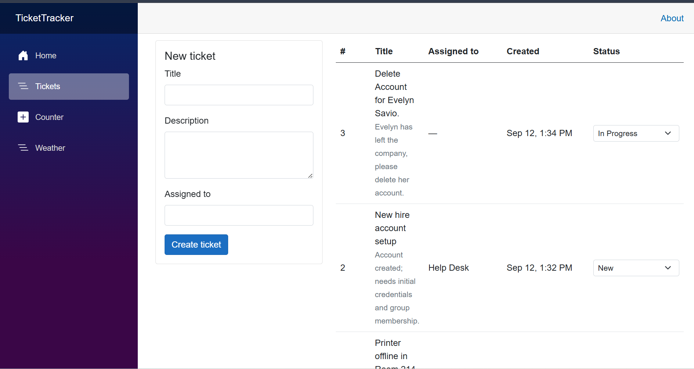

# TicketTracker

A small help-desk ticket tracker built with Blazor Server on .NET 8.



## What it does

- Create a ticket with a title, description, and assignee
- See every ticket newest-first, with a running count of open vs. resolved
- Move a ticket between **New**, **In Progress**, and **Resolved** from the list
- Reject an empty or over-long title, with the error shown inline on the form

## Why I built it

I work an IT help desk and spend my day in a ticketing system, so I wanted to
build a small version of the tool I actually use rather than a generic CRUD
demo. The sample tickets in the app are the kind of thing that comes across my
queue: a printer that dropped off the network, an account that needs setting up.

## Running it

```bash
git clone https://github.com/ideojo/TicketTracker.git
cd TicketTracker
dotnet run
```

Then open the `http://localhost:####` URL it prints and click **Tickets**.
Requires the [.NET 8 SDK](https://dotnet.microsoft.com/download).

## How it's put together

| File | Role |
|---|---|
| `Models/Ticket.cs` | The `Ticket` class and the `TicketStatus` enum. Validation rules live here as data annotations, so the form gets them for free. |
| `Services/TicketService.cs` | Owns the ticket list and the ID sequence. Registered as a singleton so every visitor sees the same data. |
| `Components/Pages/Tickets.razor` | The page: create form, table, and status dropdowns. Runs in `InteractiveServer` render mode. |

The page never touches a collection directly — it asks `TicketService` for the
data and tells it when something changes. That separation is deliberate: the
storage can be replaced without the page changing.

## Status and next steps

Tickets are held in memory, so they reset when the app restarts. That was a
deliberate first step — it kept the UI and the service boundary simple to get
right. The next piece of work is swapping the in-memory list for **EF Core with
SQLite** behind the same service methods, which shouldn't require changes to the
page.

After that: editing and deleting tickets, filtering by status, and assigning to
a real user list.

## Stack

.NET 8 · C# · Blazor Server · Bootstrap 5
